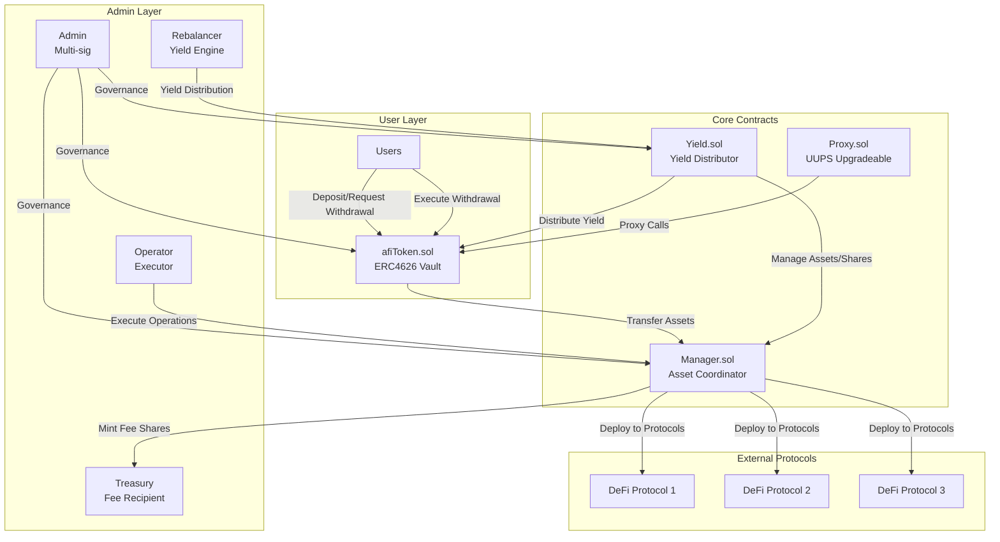
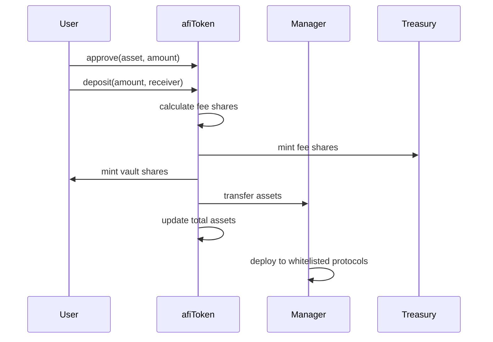
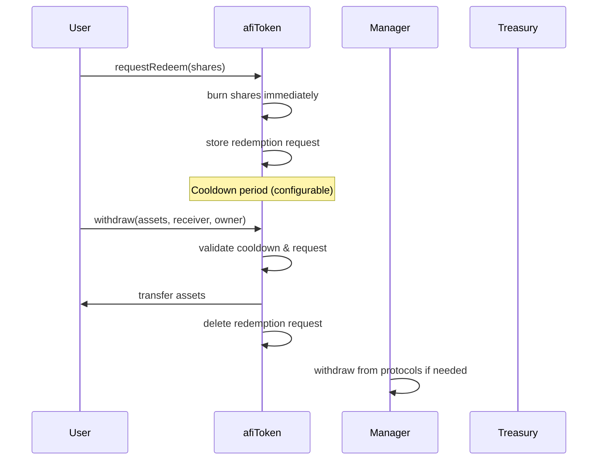
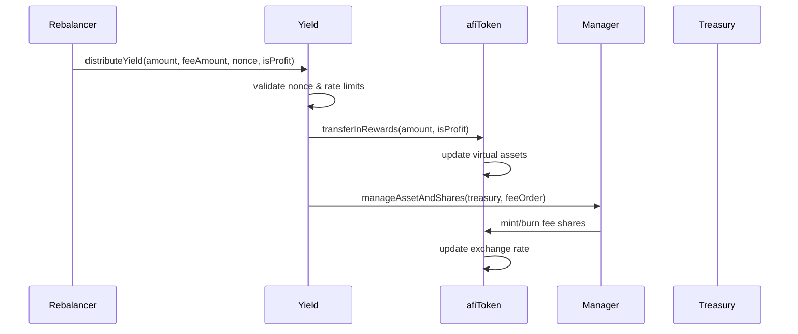

# afiUSD - ERC4626 Yield Vault

A ERC4626-compliant yield-bearing vault with withdrawal mechanisms, yield distribution, and multi-protocol asset management.

## Overview

afiUSD is an ERC4626-compliant yield-bearing vault with daily yield distribution and a withdrawal cooldown system. Users deposit stablecoins into the afiUSD contract and receive shares representing their claim on the underlying yield-generating assets.


### Core Contracts
- **afiToken.sol**: ERC4626-compliant yield-bearing vault with withdrawal cooldown and yield vesting
- **Manager.sol**: Asset deployment and protocol coordination with whitelist management
- **Yield.sol**: Yield distribution and profit/loss management with epoch-based distribution
- **Proxy.sol**: ERC1967 proxy for UUPS upgradeable contracts

### Interfaces
- **IafiUSD.sol**: Vault interface with redemption and yield management functions
- **IManager.sol**: Manager interface with asset and share management functions

### Supporting Files
- **Errors.sol**: Custom error definitions for gas optimization

## Architecture and Flow:
1. Deposits
All user deposits go directly into the afiToken's Manager Contract. In return, users receive vault shares based on the current exchange rate.
2. Asset Management
Manager contract allocates capital across various DeFi protocols to generate yield. Strategy logic is off-chain driven but triggered via on-chain transactions.
3. Yield Distribution
An off-chain engine calculates daily yield based on DeFi strategy performance. The updated yield is pushed on-chain by calling distributeYield() on the vault contract, which adjusts the share-to-asset exchange rate accordingly.
4. Withdrawals
Users initiate a withdrawal by calling requestWithdrawal(). This logs the request and starts a cooldown period (e.g., 24 hours). During this time, the off-chain engine ensures liquidity is available by unwinding strategies and depositing base assets back into the vault.
Once assets are available and the cooldown has passed, users can complete the withdrawal and redeem shares for the underlying tokens.




## Core Components

### afiToken Vault
The main vault contract implementing ERC4626 standard with advanced features:

- **ERC4626 Compliance**: Full standard implementation with UUPS upgradeability
- **Withdrawal Cooldown**: Configurable waiting period (max 7 days)
- **Redemption System**: Request-based withdrawal with cooldown mechanism
- **Fee Management**: Configurable deposit fees with treasury distribution
- **Virtual Asset Accounting**: Tracks total assets including unvested amounts
- **Pausable Operations**: Emergency pause functionality for security
- **Access Control**: Role-based permissions for admin and operator functions

### Manager Contract
Handles asset deployment and protocol interactions:

- **Multi-Protocol Deployment**: Distributes funds across whitelisted DeFi protocols
- **Asset Coordination**: Manages asset and share movements between contracts
- **Whitelist Management**: Secure external protocol interactions with validation
- **Minimum Share Enforcement**: Configurable minimum shares for operations
- **Batch Execution**: Execute multiple operations atomically
- **Treasury Management**: Fee collection and distribution
- **Redeem Cap Management**: Maximum redemption limits per vault

### Yield Contract
Manages yield distribution and profit/loss accounting:

- **Epoch-Based Distribution**: Sequential nonce system prevents duplicate distributions
- **Profit/Loss Handling**: Separate accounting for gains and losses
- **Fee Distribution**: Automatic fee collection during yield distribution
- **Rate Limiting**: Minimum distribution intervals to prevent spam
- **Percentage Limits**: Configurable maximum yield and fee percentages
- **Transaction Deduplication**: Hash-based duplicate prevention


## User Flows

### Deposit Flow



**Steps:**
1. User approves asset spending for afiToken contract
2. User calls `deposit(amount, receiver)` on afiToken
3. afiToken calculates fee shares and mints to Treasury
4. afiToken mints vault shares to user
5. Assets transferred to Manager contract
6. Total assets updated in afiToken
7. Manager deploys funds to whitelisted yield protocols

### Withdrawal Flow



**Steps:**
1. User calls `requestRedeem(shares)` on afiToken
2. Shares are burned immediately, redemption request stored
3. Cooldown period begins (configurable, max 7 days)
4. After cooldown, user calls `withdraw(assets, receiver, owner)`
5. afiToken validates cooldown period and request
6. Assets transferred to user, redemption request deleted
7. Manager withdraws from protocols if liquidity needed

### Yield Distribution Flow



**Steps:**
1. Off-chain engine calculates daily yield and fees
2. Rebalancer calls `distributeYield(amount, feeAmount, nonce, isProfit)`
3. Yield contract validates nonce and rate limits
4. Yield transferred to afiToken with profit/loss flag
5. afiToken updates virtual assets and exchange rate
6. Fee shares minted/burned to Treasury via Manager
7. Exchange rate increases for all users

## Cross-Chain Yield Distribution

### Overview

The system supports multiple vaults on different chains (e.g., ETHEREUM, L2s like Arbitum, Katana etc.) . Each vault collects deposits and generates yield. To ensure fairness, yield is distributed globally based on total deposits and yield across all chains, so that all users benefit equally regardless of which chain they are on.

### How Yield Distribution Works

1. **Collect Data from All Chains**
   - **Total Deposits:** Get the total deposited amount in each vault (e.g., ETH Chain, KATANA Chain).
   - **Yield Generated:** Get the yield generated in each vault for the period.

2. **Calculate Global Yield**
   - **Sum Deposits:**
     `totalDeposit = ethDeposit + katanaDeposit`
   - **Sum Yield:**
     `totalYield = ethYield + katanaYield`

3. **Calculate New Global Exchange Rate**
   The exchange rate represents the value of 1 share in the vault, in terms of the underlying asset.

   ```
   newExchangeRate = ((totalDeposit + totalYield) * 1e6) / totalDeposit
   ```
   - `1e6` is used for 6 decimal precision (e.g., USDC).

4. **Calculate Yield to Distribute Per Vault**
   For each vault:
   ```
   vaultYield = (newExchangeRate * vaultDeposit) / 1e6 - vaultDeposit
   ```

### Example Calculation

Suppose:
- **ETH Vault:**
  - Deposit: 500,000 USDC
  - Yield: 10,000 USDC
- **KATANA Vault:**
  - Deposit: 300,000 USDC
  - Yield: 3,000 USDC

**Step 1: Sum Deposits and Yield**
- `totalDeposit = 500,000 + 300,000 = 800,000 USDC`
- `totalYield = 10,000 + 3,000 = 13,000 USDC`

**Step 2: Calculate New Exchange Rate**
```
newExchangeRate = ((800,000 + 13,000) * 1,000,000) / 800,000 = 1,016,250
```

**Step 3: Calculate Yield for Each Vault**
- **ETH Vault:**
  ```
  ethVaultYield = (1,016,250 * 500,000) / 1,000,000 - 500,000 = 8,125 USDC
  ```
- **KATANA Vault:**
  ```
  katanaVaultYield = (1,016,250 * 300,000) / 1,000,000 - 300,000 = 4,875 USDC
  ```
- **Total Distributed:**
  `8,125 + 4,875 = 13,000 USDC` (matches total yield)

### Distribution Process

1. **Off-chain Calculation:**
   - An off-chain script or oracle collects deposit and yield data from all chains.
   - It computes the new global exchange rate and the yield to distribute to each vault.
2. **On-chain Distribution:**
   - The yield rebalancer (authorized address) calls the `distributeYield` function on each vault’s Yield contract, passing the calculated yield for that vault.
   - The vault contract updates its internal accounting and distributes the yield to users (usually with vesting).

### Key Points
- **Fairness:** All users, regardless of chain, receive yield as if all assets were pooled together.
- **Precision:** Calculations use 6 decimals (for USDC).
- **Vesting:** Yield is usually vested over a period, not instantly available.

### Summary Table

| Vault   | Deposit   | Yield   | Vault Yield Distributed |
|---------|-----------|---------|------------------------|
| ETH     | 500,000   | 10,000  | 8,125                  |
| KATANA  | 300,000   | 3,000   | 4,875                  |
| **Total** | 800,000 | 13,000  | 13,000                 |


## Key Features

### Redemption System
- **Request Phase**: Users call `requestRedeem(shares)` to initiate withdrawal
- **Immediate Burn**: Shares are burned immediately upon request
- **Cooldown Period**: Configurable waiting period (max 7 days)
- **Execution Phase**: Users call `withdraw()` after cooldown to receive assets

### Yield Distribution
- **Epoch-Based**: Sequential nonce system prevents duplicate distributions
- **Profit/Loss Handling**: Separate accounting for gains and losses
- **Rate Limiting**: Minimum distribution intervals to prevent spam
- **Fee Collection**: Automatic fee collection during yield distribution

### Fee Structure
- **Deposit Fees**: Configurable fee on deposits (collected as shares)
- **Treasury Distribution**: Fees automatically minted to treasury address
- **Percentage Limits**: Maximum yield and fee percentages enforced

### Access Control
- **DEFAULT_ADMIN_ROLE**: Contract upgrades and role management
- **ADMIN_ROLE**: Governance functions and configuration
- **OPERATOR_ROLE**: Operational functions and protocol interactions
- **REBALANCER_ROLE**: Yield distribution and rebalancing

### Security Features
- **Pausable Operations**: Emergency pause functionality
- **Whitelist Management**: Secure external protocol interactions
- **Reentrancy Protection**: Guards against reentrancy attacks
- **UUPS Upgrades**: Upgradeable contracts with admin control

## Development Setup

### Prerequisites
- Foundry (latest version)
- Node.js 16+

### Installation
```bash
# Clone repository
git clone <repository-url>
cd afiUSD

# Install Foundry
curl -L https://foundry.paradigm.xyz | bash
foundryup

# Install dependencies
forge install OpenZeppelin/openzeppelin-contracts-upgradeable
forge install OpenZeppelin/openzeppelin-contracts
forge install foundry-rs/forge-std

# Build contracts
forge build
```

### Testing
```bash
# Run all tests
forge test

# Run with verbose output
forge test -vvv

# Run specific test
forge test --match-test testDeposit

# Gas report
forge test --gas-report
```

### Deployment
```bash
# Deploy to local network
forge script script/Deploy.s.sol --rpc-url <rpc-url> --private-key <key>

# Deploy to Testnet or Mainnet
forge script script/Deploy.s.sol  --broadcast --verify --etherscan-api-key <api-key> --rpc-url <rpc-url> --private-key <key>
```

## Contract Functions

### afiToken Vault Functions

#### Deposit Operations
- `deposit(assets, receiver)`: Deposit assets for shares
- `mint(shares, receiver)`: Mint specific shares
- `previewDeposit(assets)`: Preview shares for deposit
- `previewMint(shares)`: Preview assets for mint

#### Redemption Operations
- `requestRedeem(shares)`: Request redemption (burns shares immediately)
- `withdraw(assets, receiver, owner)`: Execute withdrawal after cooldown
- `redeem(shares, receiver, owner)`: Redeem shares after cooldown
- `canExecuteRedeem(user)`: Check if redemption can be executed
- `getRedeemRequest(user)`: Get user's redemption request details

#### Yield Management
- `transferInRewards(amount, profit)`: Distribute yield (yield contract only)
- `exchangeRate()`: Get current exchange rate
- `exchangeRateScaled()`: Get scaled exchange rate
- `updateTotalAssets(amount, add)`: Update total assets (manager only)

#### Administrative Functions
- `setManager(manager)`: Set manager address (admin only)
- `setCooldownPeriod(period)`: Set cooldown period (admin only)
- `pause()/unpause()`: Pause/unpause operations (admin only)
- `emergencyRecover(token, amount, recipient)`: Emergency recovery (admin only)

### Manager Functions
- `execute(targets, data)`: Execute batch operations on whitelisted contracts
- `redeemFor(afiUSD, user)`: Redeem on behalf of user (operator only)
- `manageAssetAndShares(to, order)`: Manage assets and shares (yield only)
- `setWhitelistedAddresses(wallets, statuses)`: Manage whitelist (admin only)
- `setMinSharesInVaultToken(afiUSD, minShares)`: Set minimum shares (admin only)
- `setMaxRedeemCap(afiUSD, maxCap)`: Set maximum redeem cap (admin only)

### Yield Functions
- `distributeYield(amount, feeAmount, nonce, isProfit)`: Distribute yield (rebalancer only)
- `setManager(manager)`: Set manager address (admin only)
- `setMinDistributionInterval(interval)`: Set minimum distribution interval (admin only)
- `setMaxYieldPercentage(percentage)`: Set maximum yield percentage (admin only)
- `setMaxFeePercentage(percentage)`: Set maximum fee percentage (admin only)

## Security Considerations

### Access Control
- Multi-signature governance for critical functions
- Role-based access control for operations
- Whitelist management for external interactions

### Withdrawal Safety
- Cooldown mechanism prevents instant withdrawals
- Request/execute pattern ensures orderly exits
- Configurable limits and periods

### Asset Management
- Virtual asset accounting  
- Vesting mechanism for yield distribution

## Integration Examples

### Basic Deposit
```solidity
// Approve asset spending
IERC20(asset).approve(address(afiToken), amount);

// Deposit assets
uint256 shares = afiToken.deposit(amount, receiver);
```

### Redemption Process
```solidity
// Request redemption (burns shares immediately)
afiToken.requestRedeem(shares);

// Wait for cooldown period
require(afiToken.canExecuteRedeem(user), "Cooldown not finished");

// Execute withdrawal
uint256 assets = afiToken.withdraw(assetAmount, receiver, owner);
```

### Yield Distribution
```solidity
// Only rebalancer can call
yield.distributeYield(
    amount,        // Profit/loss amount
    feeAmount,     // Fee amount
    nonce,         // Sequential nonce
    isProfit       // Profit flag
);
```

### Manager Operations
```solidity
// Execute batch operations on whitelisted protocols
address[] memory targets = [protocol1, protocol2];
bytes[] memory data = [callData1, callData2];
manager.execute(targets, data);

// Redeem on behalf of user
manager.redeemFor(address(afiToken), user);
```


